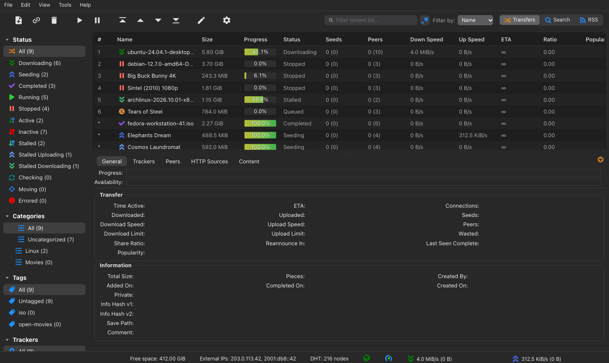
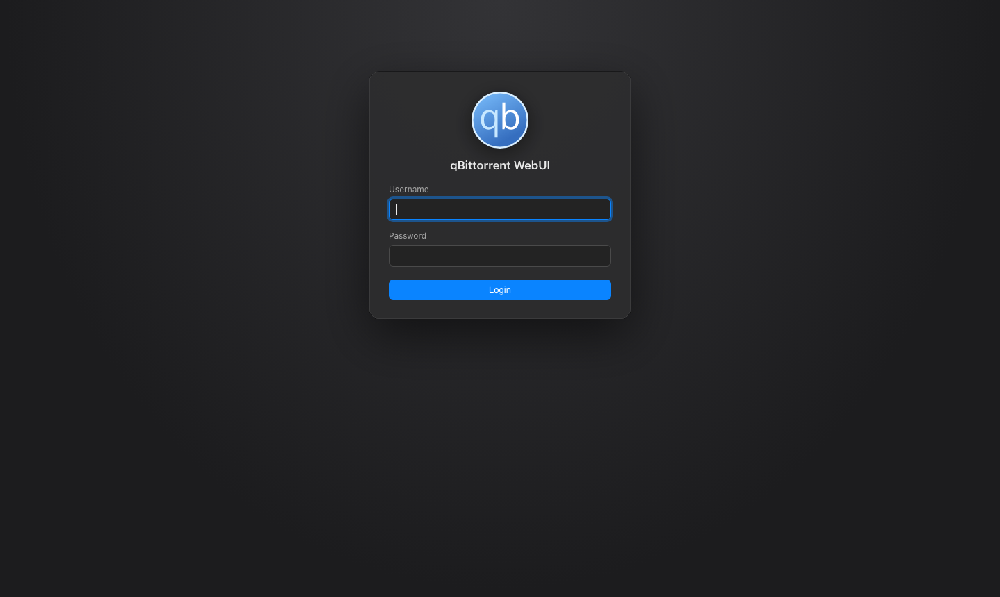

# qbit-dark

A dark alternative WebUI for qBittorrent, styled after the dark look of the desktop app:

- white glyph toolbar with a compact search and filter row
- sidebar with rounded pill selection and section triangles
- dark rounded torrent list, with the bottom panel (Trackers, Peers, HTTP Sources, Content)
  lined up and styled to match
- yellow→green progress bars and a red pause icon for stopped torrents
- dark dialogs, menus and login page

This repo contains only the theme's CSS. `build.sh` (or `build.ps1` on Windows) combines it with
the original qBittorrent WebUI files: every stock HTML, JavaScript and image file stays untouched, and only two stock CSS
files get one added `@import` line each (see [What changed](#what-changed-compared-to-stock)).

The theme runs offline: no web fonts, CDNs or external images.





Built and tested against the qBittorrent **5.2.x** WebUI. Build it from the same qBittorrent
version you run, since an alternative WebUI replaces the whole built-in one.

## Install

qBittorrent's built-in WebUI files are compiled into the program, so the alternative WebUI folder
has to be assembled from the qBittorrent source:

Linux / macOS:

```sh
git clone https://github.com/kalken/qbit-dark.git
cd qbit-dark
./build.sh 5.2.4 ~/qbit-dark-webui     # use your qBittorrent version
```

Windows (PowerShell; or download the repo as a ZIP instead of `git clone`):

```powershell
git clone https://github.com/kalken/qbit-dark.git
cd qbit-dark
powershell -ExecutionPolicy Bypass -File .\build.ps1 5.2.4 C:\qbit-dark-webui   # use your qBittorrent version
```

The script downloads that release's `src/webui/www` from qBittorrent's GitHub. If you already have
the qBittorrent source, pass its `src/webui/www` folder instead of a version number.

Then in qBittorrent → Options → Web UI, tick **Use alternative WebUI**, pick the built folder
(the one containing `public/` and `private/`), and hard-refresh the WebUI.

## What changed compared to stock

Only CSS, applied by `build.sh` / `build.ps1` to the original WebUI files:

- `private/css/style.css`: one added line, `@import url("qbit-dark.css");`
- `public/css/login.css`: one added line, `@import url("qbit-dark-login.css");`
- `private/css/qbit-dark.css`: the whole theme (from `css/` in this repo)
- `public/css/qbit-dark-login.css`: login page (from `css/` in this repo)

The icons (toolbar glyphs, sidebar triangle, sort chevrons, search, red pause) are embedded in
`qbit-dark.css` as SVG data URLs, so the theme adds no image files.

## Locked out?

If the WebUI breaks after a qBittorrent upgrade, turn the alternative WebUI off
(`WebUI\AlternativeUIEnabled=false` in `qBittorrent.conf`)
to get the stock WebUI back.

## License

The theme (`css/`, `build.sh`, `build.ps1`) is licensed GPLv3-or-later, see [COPYING.GPLv3](COPYING.GPLv3).
A built WebUI folder also contains qBittorrent's own WebUI files, which keep qBittorrent's license
(GPLv2+ for the code, GPLv3+ for the assets), see [LICENSE](LICENSE) and [COPYING.GPLv2](COPYING.GPLv2).
Toolbar glyph shapes are adapted from Google's Material Icons (Apache 2.0).

## NixOS (flake)

Add the repo as a non-flake input in `flake.nix`:

```nix
inputs = {
  # ...
  qbit-dark.url = "github:kalken/qbit-dark";
  qbit-dark.flake = false;
};
```

Package it with an overlay in a NixOS module, e.g. `qbit-theme.nix`:

```nix
# qbit-theme.nix
{ inputs, lib, ... }:
{
  nixpkgs.overlays = [
    (final: prev: {
      qbit-dark = final.stdenvNoCC.mkDerivation {
        pname = "qbit-dark";
        version = "0-unstable-${inputs.qbit-dark.shortRev}";

        src = inputs.qbit-dark;

        # Original WebUI files from the same qBittorrent package nixpkgs builds
        installPhase = ''
          runHook preInstall
          sh ./build.sh ${final.qbittorrent-nox.src}/src/webui/www $out/share/qbit-dark
          runHook postInstall
        '';

        meta = {
          description = "Dark alternative WebUI for qBittorrent";
          homepage = "https://github.com/kalken/qbit-dark";
          license = lib.licenses.gpl3Plus;
          platforms = lib.platforms.all;
        };
      };
    })
  ];
}
```

Include it as a module in `flake.nix` (with `inputs` passed to modules):

```nix
nixosConfigurations.myhost = nixpkgs.lib.nixosSystem {
  specialArgs = { inherit inputs; };
  modules = [
    ./configuration.nix
    ./qbit-theme.nix
  ];
};
```

The WebUI files come from `qbittorrent-nox`, the package `services.qbittorrent` uses by default;
if you set `services.qbittorrent.package` to something else, use that package's `src` instead.

You can then use `pkgs.qbit-dark` as the alternative WebUI in `services.qbittorrent`:

```nix
services.qbittorrent.serverConfig.Preferences.WebUI = {
  AlternativeUIEnabled = true;
  RootFolder = "${pkgs.qbit-dark}/share/qbit-dark";
};
```
